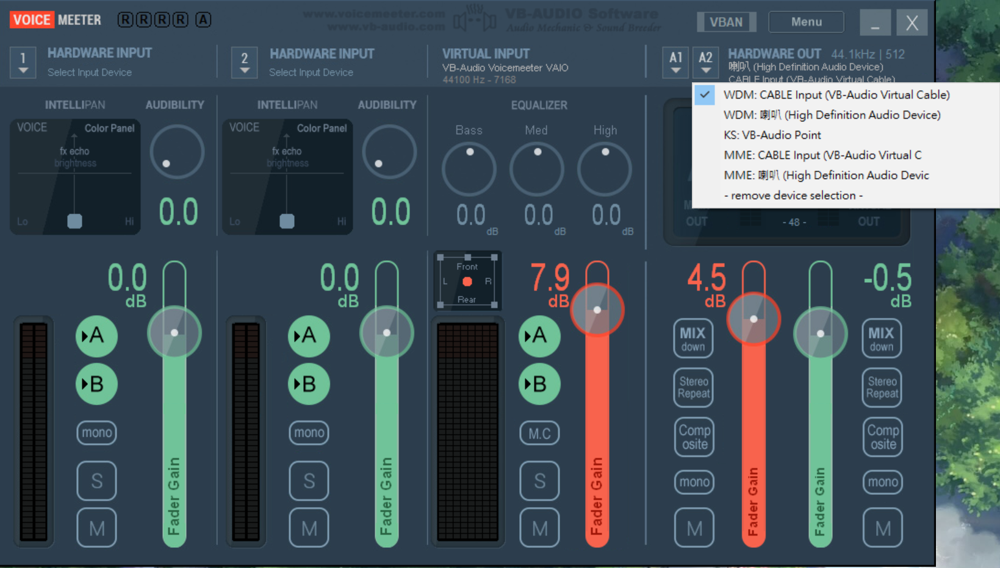

# MUF - Make U Free in your life

## ※Stop develop, skype has the alike function.

This project wannaa make you _**Free**_ in anytime.

Use MUF to **auto recognize what your girlfriend said** in `voice message` / `line` / `wechat` / `skype` etc ...

It is important that know what your girlfriend said just 3 secs ago ...

If you can't deal with this problem , just use the `MUF` to make your life better.

## Requirements

- Python package `SpeechRecognition`
- Python package `PyAudio`
- Donationware `VB-CABLE`
- Donationware `VOICEMEETER`

## How to use

Install [SpeechRecognition][speechrecognition] and [PyAudio][pyaudio] to get microphone voice and turn it to text.

```text
pip install pyaudio
pip install SpeechRecognition
```

Use the [VB-CABLE][vb-cable] to make speaker ouput to virtual audio device.
That `MUF` can get virtuaul aduio device to microphone .

Use the [VOICEMEETER][voicemeeter] to make your speaker keep your sound.

Step 1. Download and install the `VB-CABLE`

Step 2. Download and install the `VOICEMEETER`

Setp 3. Set VB-CABLE Output to your default recoder.


Setp 4. Set VoiceMeeter A2 to VB-CABLE Input.


Setp 5. Run the project . And feel free to use it !!

```bash
cd MUF
python -m muf
```


# MUF-讓你活的更自在

此專案主要是讓你可以在任何時刻都感到自由自在無拘束。

透過`MUF`去自動分析你跟你女友在 `語音訊息` / `line` / `微信語音` / `Skype` 等軟體上說的話。**將語音轉成文字的方式呈現**

當男朋友的都知道女生最愛問說：「我 3 秒前說的東西是什麼...」

如果你很常恍神而無法解決此問題，那就是者透過`MUF`來幫助你吧!!

## 安裝軟體

- Python 套件 `SpeechRecognition`
- Python 套件 `PyAudio`
- 捐贈軟體 `VB-CABLE`
- 捐贈軟體 `VOICEMEETER`

## 如何使用

安裝 [SpeechRecognition][speechrecognition] 和 [PyAudio][pyaudio] 讓麥克風可以收到聲音，並轉換成文字

```bash
pip install pyaudio
pip install SpeechRecognition
```

透過[VB-CABLE][vb-cable] 使聲音變成虛擬裝置輸出。 這樣`MUF`才可以讓虛擬裝置輸出視為麥克風輸入

透過[VOICEMEETER][voicemeeter] 讓你電腦中的聲音可以同時輸出至喇叭與 VAC(虛擬聲音裝置 Virtual-Audio Cable)

步驟一、 下載以及安裝`VB-CABLE`軟體

步驟二、 下載以及安裝 `VOICEMEETER`軟體

步驟三、 設定 VB-CABLE Output 作為聲音錄製的預設裝置


步驟四、 將 VB-CABLE Input 設定成 VoiceMeeter A2 的輸出裝置


步驟五、 切換到該專案路徑，並且享受此專案帶來的便利吧!

```bash
cd MUF
python -m muf
```


## Roadmap

- **2022/05/26 此專案暫停開發，基於不重複照輪子，Skype 目前功能已堪用**
- 將語音文字訊息與 debugging 文字分開(透過 config 方式控管)
- loggin 機制
- 將語音文字存檔
- Qt 或者其他的 GUI
- 尋找其他如 audio-router (該專案已無維護)等方式，研究不用安裝軟體即可將聲音複製一份至麥克風裝置

[speechrecognition]: https://pypi.org/project/SpeechRecognition/
[pyaudio]: https://pypi.org/project/PyAudio/
[vb-cable]: https://www.vb-audio.com/Cable/index.htm
[voicemeeter]: https://www.vb-audio.com/Voicemeeter/index.htm
