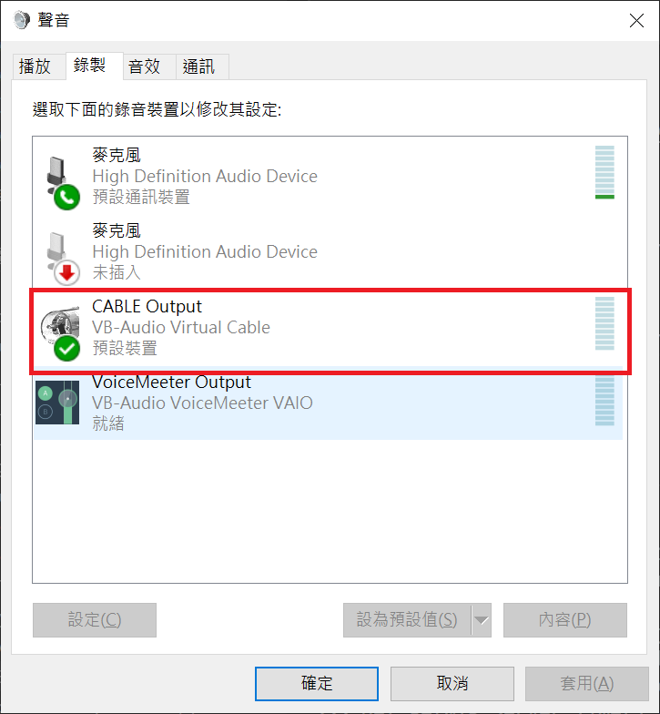
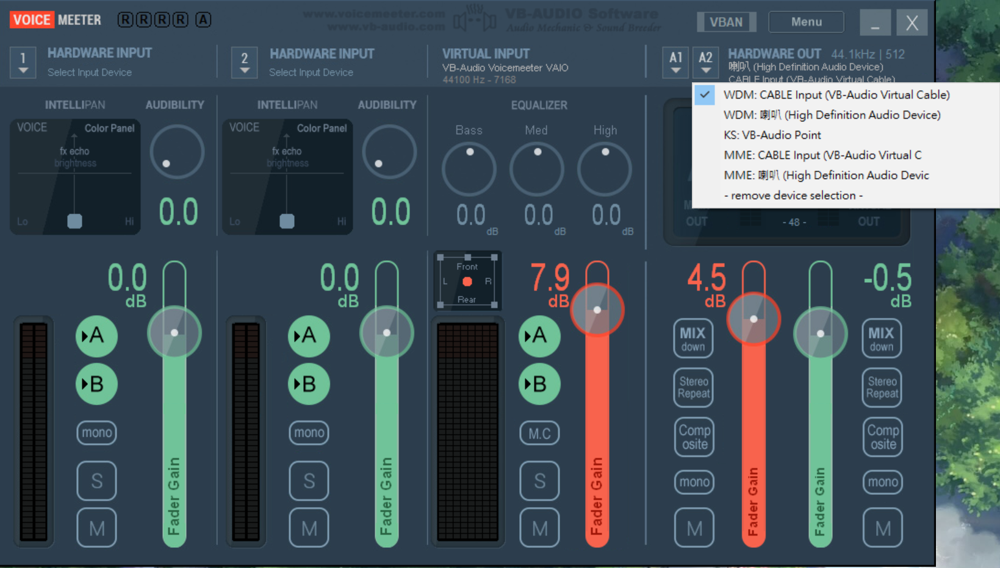
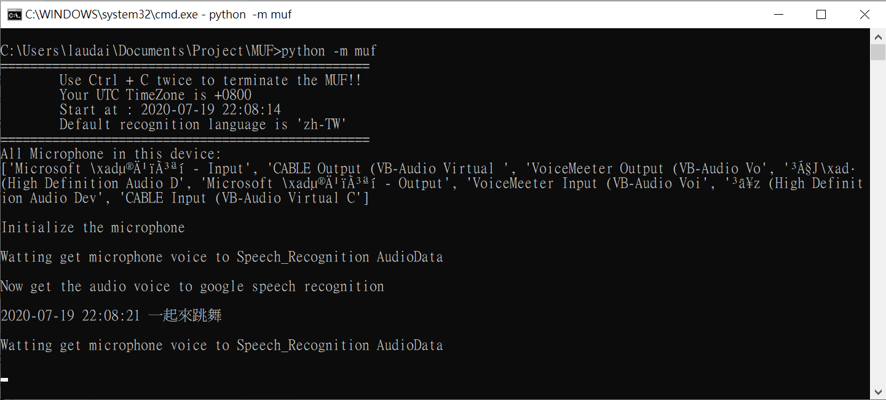

MUF - Make U Free in your life.
===
This project wannaa make you _**Free**_ in anytime.

Use MUF to **auto recognize what your girlfriend said** in `voice message` / `line` / `wechat` / `skype` etc ...

It is important that know what your girlfriend said just 3 secs ago ...

If you can't deal with this problem , just use the `MUF` to make your life better.

Requirements
---
* Python package `SpeechRecognition` 
* Python package `PyAudio `
* Donationware `VB-CABLE`
* Donationware `VOICEMEETER`

How to use
---
Install [SpeechRecognition][SpeechRecognition] and [PyAudio][PyAudio] to get microphone voice and turn it to text.
```
pip install pyaudio 
pip install SpeechRecognition
```
Use the [VB-CABLE][VB-CABLE] to make speaker ouput to virtual audio device.
That `MUF` can get virtuaul aduio device to microphone .

Use the [VOICEMEETER][VOICEMEETER] to make your speaker keep your sound.


Step 1. Download and install the `VB-CABLE`

Step 2. Download and install the `VOICEMEETER`

Setp 3. Set VB-CABLE Output to your default recoder.


Setp 4. Set VoiceMetter A2 to VB-CABLE Input.


Setp 5. Run the project . And feel free to use it !!
```
cd MUF
python -m muf
```


MUF-讓你活的更自在
===
此專案主要是讓你可以在任何時刻都感到自由自在無拘束。

透過`MUF`去自動分析你跟你女友在 `語音訊息` / `line` / `微信語音` / `Skype` 等軟體上說的話。**將語音轉成文字的方式呈現**

當男朋友的都知道女生最愛問說：「我3秒前說的東西是什麼...」

如果你很常恍神而無法解決此問題，那就是者透過`MUF`來幫助你吧!!

安裝軟體
---
* Python 套件 `SpeechRecognition` 
* Python 套件 `PyAudio `
* 捐贈軟體 `VB-CABLE`
* 捐贈軟體 `VOICEMEETER`

如何使用
---
安裝 [SpeechRecognition][SpeechRecognition] 和 [PyAudio][PyAudio] 讓麥克風可以收到聲音，並轉換成文字
```
pip install pyaudio 
pip install SpeechRecognition
```
透過[VB-CABLE][VB-CABLE] 使聲音變成虛擬裝置輸出。 這樣`MUF`才可以讓虛擬裝置輸出視為麥克風輸入

透過[VOICEMEETER][VOICEMEETER] 讓你電腦中的聲音可以同時輸出至喇叭與VAC(虛擬聲音裝置Virtual-Audio Cable)

步驟一、 下載以及安裝`VB-CABLE`軟體

步驟二、 下載以及安裝 `VOICEMEETER`軟體

步驟三、 設定VB-CABLE Output作為聲音錄製的預設裝置


步驟四、 將VB-CABLE Input 設定成VoiceMetter A2的輸出裝置


步驟五、 切換到該專案路徑，並且享受此專案帶來的便利吧!
```
cd MUF
python -m muf
```


Roadmap
---
* 將語音文字訊息與debugging文字分開(透過config方式控管)
* loggin機制
* 將語音文字存檔
* Qt 或者其他的GUI
* 尋找其他如 audio-router (該專案已無維護)等方式，研究不用安裝軟體即可將聲音複製一份至麥克風裝置

[SpeechRecognition]:https://pypi.org/project/SpeechRecognition/
[PyAudio]:https://pypi.org/project/PyAudio/
[VB-CABLE]:https://www.vb-audio.com/Cable/index.htm
[VOICEMEETER]:https://www.vb-audio.com/Voicemeeter/index.htm